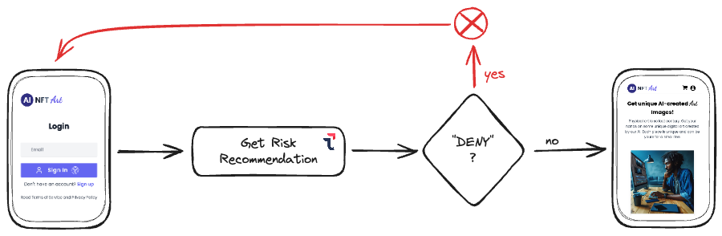
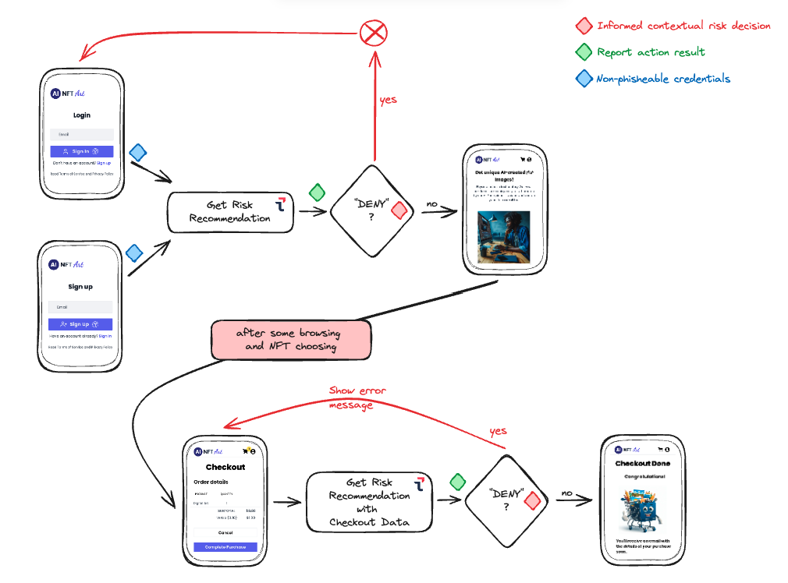

# Webinar Series - Customer Identity (by Transmit Security)

## SESSION 2: Add Risk Context 

Hi again, this is the second webinar in this series. If you already watched (or even did 🙌) the [first one](./01%20Instructions.md), some of these steps could not be needed for you, so look them over just in case and let's add some contextual risk information to our site. 💯

The code to follow along the webinar can be found on this repo:
  - Initial state: Branch `step2-starter` ([GitHub Link](https://github.com/TransmitSecurity/workshop-latam/tree/step2-starter))
  - Final code, including some code clean-up to allow for better execution when following the webinar offline: Branch `step2-final-refactor` ([GitHub Link](https://github.com/TransmitSecurity/workshop-latam/tree/step2-final-refactor))

### S2 - 0. Set up your environment
1. You are going to need [nodejs](https://nodejs.org). Install it following the instructions [here](https://nodejs.org/en/download/package-manager).
2. Get the starter code for the demo application we are going to use:
  <br>_By the way, if you did the first workshop, we are starting (more or less 🤗) from where we left, so although you could use the code you already have, it's possible we have applied some fixes or updates, so we recommend to start with the **step2-starter** branch with the command below, up to you_ 🤓.
  ```Bash
  git clone -b step2-starter https://github.com/transmitsecurity/workshop-latam
  ```
3. Install dependencies
  ```Bash
  cd workshop-latam
  npm install
  ```
4. Create configuration file
  ```Bash
  cp dotenv.example .env
  ```
5. Start the server
  ```Bash
  npm start
  ```
6. Browse to `http://localhost:3001`, you should see the login page for our brand new (and fake 🥸) **<span style="color:purple">"Artificial Intelligence-created NFT Art Site"</span>** (aka **AI NFT Art**)

### S2 - 1. Get your credentials
Your hosts in the session will provide the instructions for this step.

### S2 - 2. Include and Initialize Transmit SDK
First, edit `.env` file at the root folder and modify the following lines with the right **client_id** and **client_secret** values provided for you in step 1 (also make sure that `VITE_TS_BASE_URL` value is the right one as showed below):
```txt
### Transmit configuration ###
VITE_TS_CLIENT_ID=<your_transmit_app_client_id>
TS_CLIENT_SECRET=<your_transmit_app_client_secret>
VITE_TS_BASE_URL=https://api.transmitsecurity.io
```

You should also provide a secret value to:
```txt
JWT_SECRET_KEY=<your_secret_key>
```
This is used to generate the _Bearer_ tokens used by the application to authenticate and manage users' sessions.

Restart the application so that it gets the new values in `.env` file:
```Bash
<Ctrl>+C
npm start
```

We already included in the previous workshop the Transmit SDK and initialized it in the login and the sign-up pages (`webinar-vanilla-js/src/index.html` and `webinar-vanilla-js/src/sign-up.html` respectively).
<br>Just for reference, the script we imported:

```HTML
<!-- This loads the latest SDK within the major version 1. -->
<script
  src="https://platform-websdk.transmitsecurity.io/platform-websdk/1.x/ts-platform-websdk.js"
  defer="true"
  id="ts-platform-script"></script>
```

and we also initialized the SDK like this (using the information from `.env` file):

```Javascript
await window.tsPlatform.initialize({
  clientId: import.meta.env.VITE_TS_CLIENT_ID,
  webauthn: { serverPath: import.meta.env.VITE_TS_BASE_URL },
});
```

### S2 - 3. Add contextual risk information to make decisions in the Login
#### S2 - 3.0 Client-Side Telemetry
Transmit Security Detection and Response Services (DRS) SDK collects a lot of information that is sent to Transmit Security backend, where hundreds of detection algorithms are run simultaneously to detect attacks and weird or unexpected behavior.
Lucky you! We already integrate the SDK during the previous session, so this step is already done 🍻.

If you don't believe it, just open the _Developer Tools_ on your browser, go to the _Network_ tab and click around in the page. You will see requests to `https://collect.riskid.security/device/events`. There you have Transmit SDK sending telemetry! 🤩

So we are already collecting information and sending it to Transmit DRS collectors, but that doesn't help us, right? We want to make use of that information and ask Transmit for a risk recommendation based on the IA, ML models and algorithms applied to the collected data, and do it in the places on the website that interest us, for example the _login_ (also called **user authentication**), so let's do it. We will use the SDK to trigger an user action from client side, and then from backend, get the recommendation from Transmit DRS and based on that recommendation, decide how to proceed.

Let's start implementing the client side, triggering the _login_ action and getting a token from Transmit. Then, in the next step, we will use that token at server side to get the risk recommendation 🪄.

#### S2 - 3.1 Client-Side
First thing we are going to do is to create an object to store the action types. There are several types already created for you as you can see in the [documentation](https://developer.transmitsecurity.com/guides/risk/recommendations/), and in addition you can create more.

Since we are working with the login, let's open `webinar-vanilla-js/src/main.js` and add the following constant, for instance, at the beginning:

```Javascript
/***** RISK ACTIONS *****/
export const RISK_ACTIONS = {
  LOGIN: 'login',
};
```

With that, we are ready to edit `webinar-vanilla-js/src/index.html`.

Go to the `script` tag and let's import the constant we have just created. Look for:

```Javascript
import { showToastSync, storeSaveUser } from './main.js';
```
and change the line for this one:

```Javascript
import { showToastSync, storeSaveUser, RISK_ACTIONS } from './main.js';
```

If you remember, when we implemented Passkeys, we added two ways to authenticate: using `autofill` (when clicking on the input to write the user identifier, in this case the user's **email**, a native drop-down appears so that you can select the Passkey) and using the button, I mean, filling out the user identifier (**email** in our example) and clicking the login button. To avoid repeating code, we moved the functionality to call the backend to authenticate the user to a common method named `completePasskeyLogin`. We are going to trigger the action in that method (since we don't care about how the user is trying to login, but on the fact that they want to login), get the token and send the token to the backend in the same call that we did use to login the user.

Look for the method `completePasskeyLogin`.

Calling Transmit SDK to trigger an action is as simple as calling `triggerActionEvent` method passing as parameter the action type (the string 'login' in this case, or more concretely, the constant we have just created), so, at the top of the method, add the following code:

```Javascript
// Trigger action event
const actionResponse = await window.tsPlatform.drs.triggerActionEvent(RISK_ACTIONS.LOGIN);
```

The `actionResponse` response object contains some information, but for now we are only interested in the `actionToken` that, as commented before, we will send to our backend. So, in the body of the POST request to `webauthn/auth`, we are going to add a 3rd parameter `actionToken` with the value `actionResponse.actionToken`.

The final code should be like this:

```Javascript
/**
 * Complete login with passkey
 * @param {string} webauthnEncodedResult Encoded result from the SDK
 * @param {string} email User email
 */
async function completePasskeyLogin(webauthnEncodedResult, email) {
  // Trigger action event
  const actionResponse = await window.tsPlatform.drs.triggerActionEvent(RISK_ACTIONS.LOGIN);

  // Complete login with passkey plus risk
  const resp = await fetch(`${import.meta.env.VITE_BACKEND_BASE_URL}/webauthn/auth`, {
    method: 'POST',
    headers: {
      'Content-Type': 'application/json',
    },
    body: JSON.stringify({ 
      userId: email, 
      webauthnEncodedResult, 
      actionToken: actionResponse.actionToken 
    }),
  });
  if (resp.status !== 200) {
    console.error('Failed to login with passkey');
    showToastSync('Invalid user or passkey', 'warning');
    return;
  }

  const data = await resp.json();
  storeSaveUser(data.email, data.token);
  window.location.href = '/home.html';
}
```

Believe it or not, but...<br> 🚀 **Client-side mission complete!** 🚀

#### S2 - 3.2 Server-Side
Ooook, time to get this `actionToken` at server side and see the risk/trust recommendation. Yes, I said _risk/trust_, because based on the recommendation you will be able to make a well-informed decision to block, step-up or anything you want to the risky user actions (👺) and maybe (also up to you) lower the friction for the "good" users (😇).

The first thing that we need is a method to call the Transmit backend API to get the risk recommendation from the `actionToken`. This method, although backend to backend communication, needs to be protected, so a **client access token** is also required.

If you followed the previous workshop (if not don't worry and keep reading 😉) you surely remember we created a method to get the **client access token**. We are going to make a small change because the tokens for Transmit DRS need a concrete _resource_ param, so go to `webinar-server/src/services/transmitService.js`, look for the definition of `getClientAccessToken`, that looks like this:

```Javascript
/**
 * Get ClientAccessToken using client credentials flow
 * @returns client access_token
 */
export const getClientAccessToken = async () => {
  const formData = {
    client_id: process.env.VITE_TS_CLIENT_ID,
    client_secret: process.env.TS_CLIENT_SECRET,
    grant_type: 'client_credentials',
  };

  try {
    const resp = await fetch(`${process.env.VITE_TS_BASE_URL}/oidc/token`, {
      method: 'POST',
      headers: {
        'Content-Type': 'application/x-www-form-urlencoded',
      },
      body: new URLSearchParams(formData).toString(),
    });

    const data = await resp.json();
    return data.access_token;
  } catch (error) {
    console.error(`${ERROR_CLIENT_ACCESS_TOKEN}: ${error.message}`);
    throw new Error(ERROR_CLIENT_ACCESS_TOKEN);
  }
};
```

and change it for the following:

```Javascript
/**
 * Get ClientAccessToken using client credentials flow
 * @param {String} resource Target Resource for the ClientAccessToken (optional)
 * @returns client access_token
 */
export const getClientAccessToken = async (resource) => {
  const formData = {
    client_id: process.env.VITE_TS_CLIENT_ID,
    client_secret: process.env.TS_CLIENT_SECRET,
    grant_type: 'client_credentials',
  };
  if (resource) formData.resource = resource;

  try {
    const resp = await fetch(`${process.env.VITE_TS_BASE_URL}/oidc/token`, {
      method: 'POST',
      headers: {
        'Content-Type': 'application/x-www-form-urlencoded',
      },
      body: new URLSearchParams(formData).toString(),
    });

    const data = await resp.json();
    return data.access_token;
  } catch (error) {
    console.error(`${ERROR_CLIENT_ACCESS_TOKEN}: ${error.message}`);
    throw new Error(ERROR_CLIENT_ACCESS_TOKEN);
  }
};

/** Target Resource for DRS Client Access Token */
const DRS_RESOURCE = 'https://risk.identity.security';

/**
 * Get DRS ClientAccessToken using client credentials flow
 * @returns client access_token
 */
export const getDRSClientAccessToken = async () => {
  return getClientAccessToken(DRS_RESOURCE);
};
```

As you can see, we have added a new param in the original method to request the token based on a _resource_ if present. Also we added a convenience method to get a **client access token** for DRS.

Perfect, we have everything we need to get the recommendation. In the same `transmitService.js` file we are editing, add the following method definition:

```Javascript
/**
 * Fetch DRS recommendation
 * @param {String} actionToken Obtained from the SDK
 * @param {String} riskClientAccessToken  ClientAccessToken for the DRS API
 */
export const getDRSRecommendation = async (actionToken, riskClientAccessToken) => {
  try {
    const query = new URLSearchParams({ action_token: actionToken }).toString();

    const resp = await fetch(`${process.env.VITE_TS_BASE_URL}/risk/v1/recommendation?${query}`, {
      method: 'GET',
      headers: {
        Authorization: `Bearer ${riskClientAccessToken}`,
      },
    });

    const data = await resp.json();
    //console.log(`DRS Recommendation: ${JSON.stringify(data, null, 2)}`);
    return data;
  } catch (error) {
    console.error(`${ERROR_RISK_GET_RECOMMENDATION}: ${error.message}`);
    throw new Error(ERROR_RISK_GET_RECOMMENDATION);
  }
};
```

With that we can call Transmit Detection and Response Services to get the recommendation. Before leaving this file, we are going to import `ERROR_RISK_GET_RECOMMENDATION` constant from `../helpers/constants.js` although we have not created it yet (we'll be doing it soon).

Modify the import at the beginning of `transmitService.js` to look like this:

```Javascript
import {
  ERROR_CLIENT_ACCESS_TOKEN,
  ERROR_PASSKEY_AUTHENTICATION,
  ERROR_PASSKEY_REGISTRATION,
  ERROR_RISK_GET_RECOMMENDATION,     // <-- We just added this line
} from '../helpers/constants.js';
```

Let's go over the **controllers** and **routers** to finish a simple integration for the login.

Create a new file `webinar-server/src/controllers/riskController.js` to add the business logic for this login use case. Add the following to the file:

```Javascript
import { ERROR_RISK_DENY, ERROR_RISK_INVALID_ACTION_TOKEN, RECOMMENDATIONS } from '../helpers/constants.js';
import { getDRSClientAccessToken, getDRSRecommendation } from '../services/transmitService.js';

/**
 * Gets risk recommendation from DRS for the provided action token
 * @param {String} actionToken DRS action token
 * @returns Risk recommendation (JSON)
 */
const getRiskRecommendation = async (actionToken) => {
  // Validate action token
  if (!actionToken) {
    console.log(ERROR_RISK_INVALID_ACTION_TOKEN);
    console.log(`Action Token: ${actionToken}`);
    throw new Error(ERROR_RISK_INVALID_ACTION_TOKEN);
  }

  // Get risk recommendation
  try {
    const riskClientAccessToken = await getDRSClientAccessToken();
    return await getDRSRecommendation(actionToken, riskClientAccessToken);
  } catch (error) {
    console.error(error.message);
    throw new Error(error.message);
  }
};

/**
 * Manages risk for login
 * @param {String} actionToken DRS action token
 * @returns recommendation
 * @throws Error based on the recommendation (only for DENY)
 */
const manageRiskLogin = async (actionToken) => {
  try {
    const recommendation = await getRiskRecommendation(actionToken);
    console.log(recommendation); // TODO: for visibility only, remove in production

    // Login Business Logic:
    //   Only deny login if recommendation is DENY, otherwise continue
    if (recommendation.recommendation.type === RECOMMENDATIONS.DENY) {
      throw new Error(ERROR_RISK_DENY);
    }
    return recommendation;
  } catch (error) {
    console.error(error.message);
    throw new Error(error.message);
  }
};

export default { manageRiskLogin };
```

As you can see, we split the functionality into 2 🤝 methods: one that uses `transmitService.js` to get the recommendation and the second one that _handles_ the business logic to protect the login. For this workshop we decided to do something very easy: if the recommendation is "DENY", we do not allow the user to login 🙅‍♂️, otherwise, user can go ahead to the home page 🏄.

We added some messages and also the possible recommendation results in the code so far, so edit `webinar-server/src/helpers/constants.js` and add the following constants:

```Javascript
export const ERROR_RISK_GET_RECOMMENDATION = 'Error getting risk recommendation';
export const ERROR_RISK_INVALID_ACTION_TOKEN = `${ERROR_RISK_GET_RECOMMENDATION}: Invalid action token`;
export const ERROR_RISK_DENY = 'Risk recommendation is to deny';

export const RECOMMENDATIONS = {
  DENY: 'DENY',
  CHALLENGE: 'CHALLENGE',
  ALLOW: 'ALLOW',
  TRUST: 'TRUST',
};
```
(With this new constants we also get rid of the error we had in `transmitService.js`)

And finally, it's time to update the _router_ and add the controls we've just created to our _passkeys-based_ login. Open `webinar-server/src/routes/defaultRouter.js`.

At the top of the file, add the following imports:

```Javascript
import riskController from '../controllers/riskController.js';
import dbService from '../services/dbService.js';
```

Look for the router method that handles the passkeys login:

```Javascript
// The auth-passkeys endpoint that authenticates a passkey
defaultRouter.post('/webauthn/auth', async (req, res) => {
  const { webauthnEncodedResult, userId } = req.body;
  if (!webauthnEncodedResult) return res.status(400).json({ message: 'Invalid request' });
  try {
    const { token, userid } = await passkeysController.authUserPasskey(webauthnEncodedResult, userId);
    return res.status(200).json({ message: 'success', token, email: userid });
  } catch (error) {
    return res.status(401).json({ message: error.message });
  }
});
```

and change it for this:

```Javascript
// The auth-passkeys endpoint that authenticates a passkey
defaultRouter.post('/webauthn/auth', async (req, res) => {
  const { webauthnEncodedResult, actionToken, userId } = req.body;
  if (!webauthnEncodedResult) return res.status(400).json({ message: 'Invalid request' });
  try {
    // Manage risk recommendation for login
    const recommendation = await riskController.manageRiskLogin(actionToken);
    // Authenticate the user with the passkey
    const { token, userid } = await passkeysController.authUserPasskey(webauthnEncodedResult, userId);

    // Store the recommendation in the database
    await dbService.saveLastRiskRecommendation(userid, recommendation);

    return res.status(200).json({ message: 'success', token, email: userid });
  } catch (error) {
    return res.status(401).json({ message: error.message });
  }
});
```

We're using `riskController` to manage the risk for the login (remember we decided to block users with a "DENY" recommendation). As we do not want to provide any clues to the bad guys, `manageRiskLogin()` will throw an Error after receiving a "DENY" and the login functionality will be the same regardless of the reason for the unsuccessful login, that's why we didn't add any special error handling for it.

In addition, and just for demo purposes, we decided to store the last recommendation for the user (only if authentication was _allowed_), so we need to add the corresponding method to the `dbService`. Open `webinar-server/src/services/dbService.js` and add the following method definition:

```Javascript
const saveLastRiskRecommendation = async (userid, recommendation) => {
  const user = db.data.users.find((u) => u.userid === userid);
  user.lastRiskRecommendation = recommendation;
  await db.write();
};
```

and don't forget to export it. At the end of the file, change:

```Javascript
const dbService = {
  getUserByUserId,
  addUser,
  deleteUser,
  addPurchase,
};
export default dbService;
```

by

```Javascript
const dbService = {
  getUserByUserId,
  addUser,
  deleteUser,
  addPurchase,
  saveLastRiskRecommendation,
};
export default dbService;
```

So far we have added risk context and recommendation to our login. Once the user logs in, we should tell DRS about the user identifier for traceability, so let's add this simple functionality to our login page too.

Edit `webinar-vanilla-js/src/index.html` and look for the method `completePasskeyLogin`. At the end of the method, we are storing locally the **user identifier** and the **access_token**, and then redirecting the navigation to the home page:

```Javascript
storeSaveUser(data.email, data.token);
window.location.href = '/home.html';
```

Let's set the _userId_ before redirecting. Change the above code for the next one:

```Javascript
storeSaveUser(data.email, data.token);

// Set User ID for traceability
try {
  const setAuthnUserOk = await window.tsPlatform.drs.setAuthenticatedUser(data.email);
  console.log('Set Authenticated User:', setAuthnUserOk ? 'OK' : 'Failed');
} catch (error) {
  console.warn('Failed to set authenticated user', error);
  showToastSync('Failed to set authenticated user', 'warning');
}

window.location.href = '/home.html';
```

We are just calling Transmit SDK to set the authenticated user, in this case, with the _email_, that is what we are using to identify the users.

**AWESOME!** 😎, you just added (basic) logic to your login process to get risk context information and make an informed decision to let your users continue authenticating or not. 💪



---

🎊 🎊 🎊 The job is done, congratulations 🎊 🎊 🎊.

 <small>"Powered By GIPHY"</small>

---

### S2 - 4. Unfinished business

But wait 🤔, the **login** step is not the only one we would like to add risk context to, right? We (and I'm sure _you_ too) would like to do something similar for the registration 🆕 and for the checkout 🤑.

Unfortunately, we started from a very simple vanilla application, without using external frameworks, to focus on the authentication first, and now on risk management, and it's time to do some refactoring so that we can continue improving the user experience in a simple way.

Things we are going to do in the refactoring:
- Split `webinar-vanilla-js/src/main.js` into several javascript files in the folder `webinar-vanilla-js/src/js/` to keep every functionality separated and more clean&clear.
- Move Transmit SDK load and initialization outside of the html pages (we are creating a function `loadAndInitTsSdk` exported by `main.js` taking care of this).

In addition, we took advantage of the refactoring to add risk context to all the _login_ and _registration_ flows, and also to the _checkout_ flow with some particularities we'll see in a moment.

You can get the 🌟 refactored code 🌟 from here:

```Bash
git clone -b step2-final-refactor https://github.com/transmitsecurity/workshop-latam
```

👀❗ Don't forget to create the **.env** file and update the relevant values (_client_id_, _client_secret_ and _jwt_client_secret_). Or if you prefer to reuse the one you created at the beginning, simply add this key value pair:

```txt
VITE_TS_SDK_URL=https://platform-websdk.transmitsecurity.io/platform-websdk/1.x/ts-platform-websdk.js
```

Finally, install the dependencies and start the application:

```bash
npm install
npm start
```

The rest of the changes we made mainly consist on:

#### S2 - 4.1 Changes to Registration
Before doing the Passkey generation client-side and registration, we added code to trigger the corresponding `register` action event:

```Javascript
// Trigger action event
const actionResponse = await window.tsPlatform.drs.triggerActionEvent(RISK_ACTIONS.REGISTER);
```

and also included the action token in the body of the request to `/webauthn/register` to complete user Passkey registration:

```Javascript
...
body: JSON.stringify({
  webauthnEncodedResult: encodedResult,
  userId: email,
  actionToken: actionResponse.actionToken,
}),
...
```

#### S2 - 4.2 Changes to Checkout
After validating checkout form, we added the code to trigger the corresponding action event, this time the `checkout` action.

```Javascript
// Trigger action event: checkout
const actionResponse = await window.tsPlatform.drs.triggerActionEvent(RISK_ACTIONS.CHECKOUT);
```

and the retrieved action token in the response is included in the body of the POST request to `/art/checkout` to complete the purchase.

```Javascript
...
body: JSON.stringify({
  purchase: data,
  cart: user.cart,
  actionToken: actionResponse.actionToken,
})
...
```

In both cases, we also included similar code to the one we created for the _login_ use case in the _router_ and _controller_.

And while we are at it, we did the same for the password based login and registration, just in case 😎.

#### S2 - 4.3 Transaction information in Checkout risk context
So far, so good, all the code we have added is just a copycat of what we did step by step in the _login with passkeys_ functionality, but there is something worth highlighting related to the checkout: Transmit DRS allows you to add transactional related information to the `triggerActionEvent` call to get more context and provide more accurate recommendations taking into account information like the amount, the currency, the reason, the date, payee and payer information, etc. (all the information that can be sent is available [here](https://developer.transmitsecurity.com/sdk-ref/platform/interfaces/transactiondata/)).

So, since we allow customers to make a purchase, we can take advantage of this and include some of the data collected in the purchase form. This way, Transmit DRS can use this data in its AI and ML models and improve the detection as stated in the previous paragraph:

```Javascript
// Trigger action event: checkout
const actionResponse = await window.tsPlatform.drs.triggerActionEvent(RISK_ACTIONS.CHECKOUT, {
  transactionData: {
    amount: totalAmount,
    currency: 'USD',
    reason: `Purchased ${Object.keys(user.cart).reduce((acc, key) => acc + user.cart[key].quantity, 0)} NFTs for ${totalAmount} USD.`,
    transactionDate: Date.now(),
    payer: {
      name: user.userid,
    },
  },
});
```

We have decided to include only a few data for demo purposes, but it's up to you to collect more information from the user and add it to the `transactionData` object in the `triggerActionEvent` call.

#### S2 - 4.4 Action Feedback 💁
Finally, while we were preparing this webinar, Transmit R&D team added a nice functionality to provide feedback about the result of an action, that is, when, for example, a user tries to login, you can provide feedback about the result of the action (the login completed successfully, the login failed, or maybe the login didn't complete). This is important information for Transmit DRS models, it's not the same when a user fails one login than when a user fails ten 🤓.

To use this functionality, we added the following function in `webinar-server/src/services/transmitService.js`:

```Javascript
/**
 * Report DRS Action Result
 * @param {String} actionToken DRS ActionToken
 * @param {String} result Result of the action
 * @param {String} riskClientAccessToken ClientAccessToken for the DRS API
 * @param {String} userId (Optional) User Identifier
 * @param {String} challengeType (Optional) Challenge Type
 * @returns action report JSON response
 */
export const reportDRSActionResult = async (
  actionToken,
  result,
  riskClientAccessToken,
  userId = null,
  challengeType = null,
) => {
  // Validate result and challengeType
  if (!Object.values(REPORT_RESULTS).includes(result)) {
    console.error(`${ERROR_RISK_REPORT_ACTION}: Invalid result`);
    throw new Error(ERROR_RISK_REPORT_ACTION);
  }
  if (challengeType && !Object.values(REPORT_CHALLENGE_TYPE).includes(challengeType)) {
    console.error(`${ERROR_RISK_REPORT_ACTION}: Invalid challenge type`);
    throw new Error(ERROR_RISK_REPORT_ACTION);
  }

  // Report action result
  try {
    const body = {
      action_token: actionToken,
      result: result,
    };
    if (userId) body.user_id = userId;
    if (challengeType) body.challenge_type = challengeType;

    const resp = await fetch(`${process.env.VITE_TS_BASE_URL}/risk/v1/action/result`, {
      method: 'POST',
      headers: {
        'Content-Type': 'application/json',
        Authorization: `Bearer ${riskClientAccessToken}`,
      },
      body: JSON.stringify(body),
    });

    if (resp.status === 201) {
      console.log(
        `Action result reported: ${result} for ${actionToken} [user: ${userId}, challenge: ${challengeType}]`,
      );
      const data = await resp.json();
      console.log(`Action reported: ${JSON.stringify(data)}`); // for visibility only
      return data;
    } else {
      console.error(`Error reporting action result: ${resp.status}`);
      throw new Error(ERROR_RISK_REPORT_ACTION);
    }
  } catch (error) {
    console.error(`${ERROR_RISK_REPORT_ACTION}: ${error.message}`);
    throw new Error(ERROR_RISK_REPORT_ACTION);
  }
};
```

In the `webinar-server/src/controllers/riskController.js`, we added this method:

```Javascript
/**
 * Report Action Result after triggerActionEvent
 * @param {String} actionToken Action Token
 * @param {String} result Action result to report
 * @param {String} userId (Optional) User Identifier
 * @param {String} challengeType (Optional) Challenge Type
 * @returns report response JSON
 */
const reportActionResult = async (actionToken, result, userId = null, challengeType = null) => {
  try {
    const riskClientAccessToken = await getDRSClientAccessToken();
    const repRes = await reportDRSActionResult(actionToken, result, riskClientAccessToken, userId, challengeType);
    return repRes;
  } catch (error) {
    console.error(error.message);
    //throw new Error(error.message); // Not throwing error to allow the action to continue
  }
};
```

and also exported helper methods to call `reportActionResult` in every action, something similar to this one for the _login_ action:

```Javascript
/**
 * Report Action Result for login with passkey
 * @param {String} actionToken Action Token
 * @param {String} result Action result to report
 * @param {String} userId (Optional) User Identifier
 * @returns report response JSON
 */
const reportLoginPasskeyActionResult = async (actionToken, result, userId = null) => {
  return await reportActionResult(actionToken, result, userId, REPORT_CHALLENGE_TYPE.PASSKEY);
};
```

finally, in every action declared in `webinar-server/src/routes/defaultRouter.js`, when the action was successful, we called it with `success` as the second argument:

```Javascript
// Report the action result
await riskController.reportLoginPasskeyActionResult(actionToken, REPORT_RESULTS.SUCCESS, userid);
```

otherwise, the call it with `failure`:

```Javascript
// Report the action result
await riskController.reportLoginPasskeyActionResult(actionToken, REPORT_RESULTS.FAILURE, userId);
```

and the implementation, of course, covers all the functionality where we previously added risk context: password-based login and registration, passkey-based login and registration and checkout.

Here is an schema of what we have built so far:



Hoping everything is clear and you have realized the power and the possibilities of contextual risk actions, we go for a coffee now  ☕ 🧁. 

**Stay tunned for our next episode!!!**