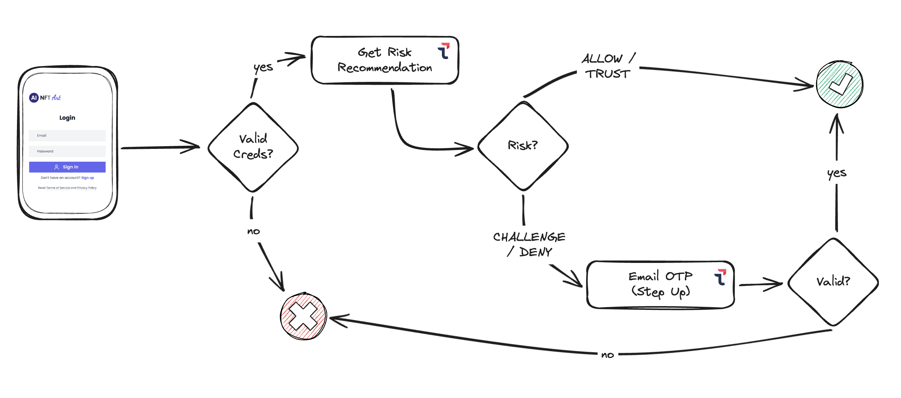
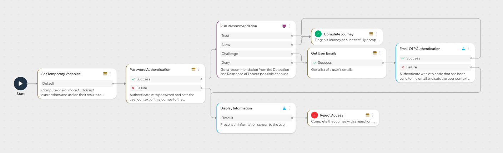
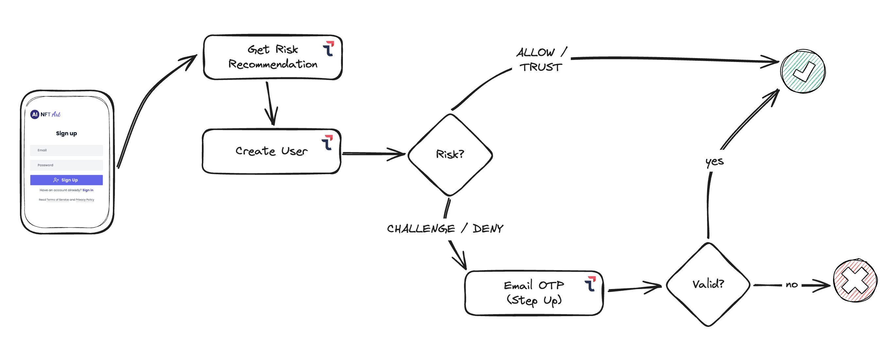
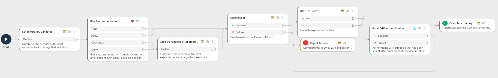
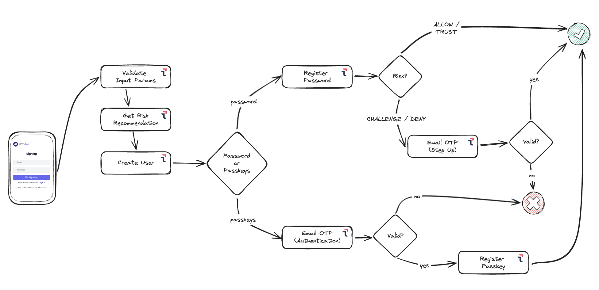
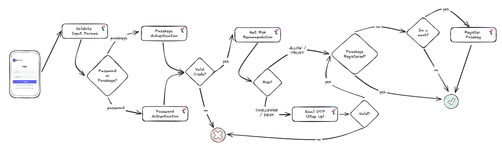
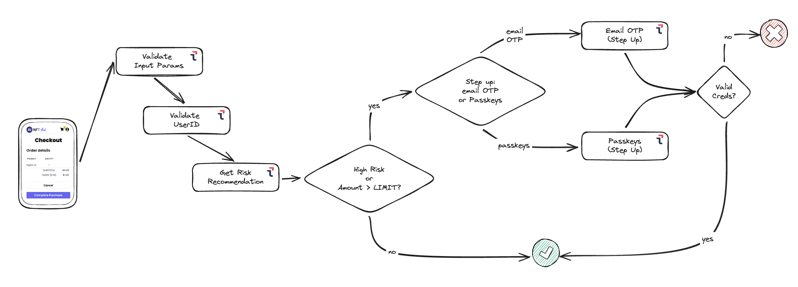
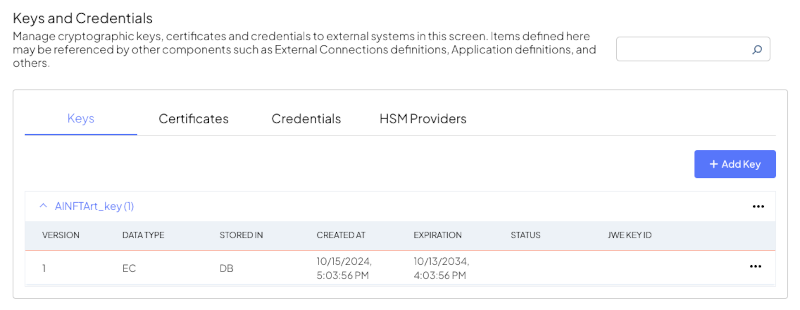
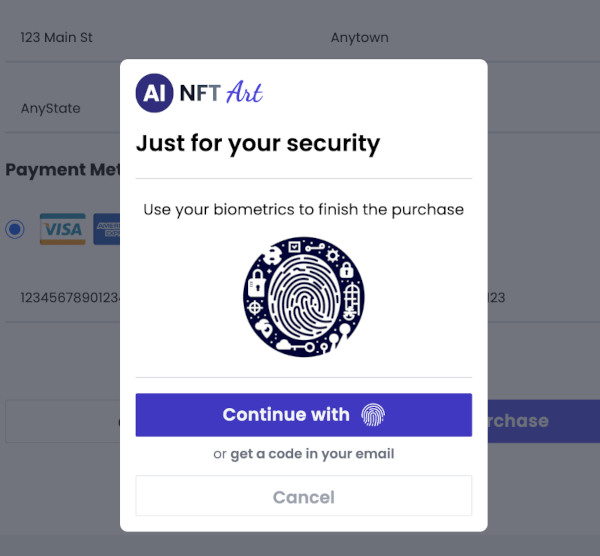

# Webinar Series - Customer Identity (by Transmit Security)

## SESSION 3: Orchestrate your risky actions

**Wow!!! this is 3️⃣ in a row!!! 🥇 🥈 🥉.** 

Welcome to the 🌟<span style="color:red">**THIRD WEBINAR**</span>🌟 in this series. 

If you already watched and/or did 🥳 the [first one](./01%20Instructions.md) or the [second one](./02%20Instructions.md), we are going to continue working with the same application, but in this case, we are going to move the logic behind some actions, like the login, the registration, and the checkout, to a centralized place: the **Mosaic Identity Orchestration Service**, and we will see how easy is to modify the logic behind each journey from a no-code editor via the Mosaic portal. If you are new to this series, don't worry at all, you don't need any previous context to follow this one and the starting code is ready for everyone, so just keep reading and 💻 **good coding** 💻!

The code to follow along the webinar can be found on this repo:
    - Initial state (before starting integration): Branch `step3-starter` ([GitHub Link](https://github.com/TransmitSecurity/workshop-latam/tree/step3-starter))
    - Intermediate state (Login): Branch `step3-01-login` ([GitHub Link](https://github.com/TransmitSecurity/workshop-latam/tree/step3-01-login))
  - Intermediate state (Registration): Branch `step3-03-register` ([GitHub Link](https://github.com/TransmitSecurity/workshop-latam/tree/step3-02-register))
  - Final code: Branch `step3-final` ([GitHub Link](https://github.com/TransmitSecurity/workshop-latam/tree/step3-final))

### S3 - 0. Set up your environment
1. You are going to need [nodejs](https://nodejs.org). Install it following the instructions [here](https://nodejs.org/en/download/package-manager).
2. Get the starter code for the demo application we are going to use:
  ```Bash
  git clone -b step3-starter https://github.com/transmitsecurity/workshop-latam
  ```
3. Install dependencies
  ```Bash
  cd workshop-latam
  npm install
  ```
4. Create configuration file
  ```Bash
  cp dotenv.example .env
  ```
5. Start the server
  ```Bash
  npm start
  ```
6. Browse to `http://localhost:3001`, you should see the login page for our brand new (and fake 🥸) **<span style="color:purple">"Artificial Intelligence-created NFT Art Site"</span>** (aka **AI NFT Art**)

### S3 - 1. Get your credentials
Your hosts in the session will provide the instructions for this step.

### S3 - 2. Include and Initialize Transmit SDK
First, edit `.env` file at the root folder and modify the following lines with the right **client_id** and **client_secret** values provided for you in step 1 (also make sure that `VITE_TS_BASE_URL` value is the right one as showed below):
```txt
### Transmit configuration ###
VITE_TS_CLIENT_ID=<your_transmit_app_client_id>
TS_CLIENT_SECRET=<your_transmit_app_client_secret>
VITE_TS_BASE_URL=https://api.transmitsecurity.io
```

You should also provide a secret value to:
```txt
JWT_SECRET_KEY=<your_secret_key>
```
This is used to generate the _Bearer_ tokens used by the application to authenticate and manage users' sessions.

Restart the application so that it gets the new values in `.env` file:
```Bash
<Ctrl>+C
npm start
```

The next step is to load the Mosaic Platform SDK, that following the (documentation)[https://developer.transmitsecurity.com/guides/orchestration/sdk/web_sdk_guide/] can be done like:

```HTML
<!--Loads the latest SDK version. See changelog for details and update version if necessary -->
<script src="https://platform-websdk.transmitsecurity.io/platform-websdk/latest/ts-platform-websdk.js" id="platform-sdk" defer="true"></script>
```

But since we have several pages in our app, we already created a helper Javascript file (`webinar-vanilla-js/src/js/transmit-helper.js`) to take care about it, that, among other things, loads the SDK from the value of the environment variable `VITE_TS_SDK_URL`, so we only need to make sure that in our `.env` file we have declared this key with the right value:

```txt
// .env file
VITE_TS_SDK_URL=https://platform-websdk.transmitsecurity.io/platform-websdk/latest/ts-platform-websdk.js
```

> [!NOTE] NOTE
> _Remember that if you change the **.env** file you need to restart the server to get the changes_.

Besides, we need to initialize the orchestration module (`ido`) of the SDK, so open the helper javascript file mentioned above (`webinar-vanilla-js/src/js/transmit-helper.js`), look for the method `initTsSdk` that looks like this:

```Javascript
const initTsSdk = async () => {
  try {
    await window.tsPlatform.initialize({
      clientId: import.meta.env.VITE_TS_CLIENT_ID,
      webauthn: { serverPath: import.meta.env.VITE_TS_BASE_URL },
    });
    console.log('TS Platform SDK initialized');
  } catch (error) {
    console.error('TS Platform SDK initialization failed:', error);
    throw error;
  }
};
```

and change it for:

```Javascript
const initTsSdk = async () => {
  try {
    await window.tsPlatform.initialize({
      clientId: import.meta.env.VITE_TS_CLIENT_ID,
      webauthn: { serverPath: import.meta.env.VITE_TS_BASE_URL },
      ido: { serverPath: `${import.meta.env.VITE_TS_BASE_URL}/ido` },  // <-- NEW LINE
    });
    console.log('TS Platform SDK initialized');
  } catch (error) {
    console.error('TS Platform SDK initialization failed:', error);
    throw error;
  }
};
```

as you can see, we have added a new value `ido` to the initialization object, and with that, we are ready to start using centralized identity orchestration journeys in our application. Let's start with the Login 🥳.

> [!NOTE] NOTE
> _Keep in mind we are continuing with the same application where we added **Passkeys** based authentication and then **Contextual Risk** decisions, so some of the explanations and code we are going to use is specific for this application because we want to keep everything we have built so far_.

### S3 - 3. Orchestrate the business logic for the Login

#### S3 - 3.0 SDK types (for convenience 😅)
First of all, for convenience reasons, and provided that we are not using a typed language (like TypeScript) but just vanilla Javascript, we are going to create a new file with some constants used by the Mosaic Platform SDK so that working with the orchestration module is easier for us.

Create a new file `webinar-vanilla-js/src/js/transmit-ido-sdk_interface.js` with the following content:

```Javascript
/**
 * @enum
 * @description The enum for the log levels.
 */
export var LogLevel;
(function (LogLevel) {
  LogLevel[(LogLevel['Debug'] = 0)] = 'Debug';
  LogLevel[(LogLevel['Info'] = 1)] = 'Info';
  LogLevel[(LogLevel['Warning'] = 2)] = 'Warning';
  LogLevel[(LogLevel['Error'] = 3)] = 'Error';
})(LogLevel || (LogLevel = {}));
/**
 * @enum
 * @description The enum for the sdk error codes.
 */
export var ErrorCode;
(function (ErrorCode) {
  ErrorCode['InvalidInitOptions'] = 'invalid_initialization_options';
  ErrorCode['NotInitialized'] = 'not_initialized';
  ErrorCode['NoActiveJourney'] = 'no_active_journey';
  ErrorCode['NetworkError'] = 'network_error';
  ErrorCode['ClientResponseNotValid'] = 'client_response_not_valid';
  ErrorCode['ServerError'] = 'server_error';
  ErrorCode['InvalidState'] = 'invalid_state';
  ErrorCode['InvalidCredentials'] = 'invalid_credentials';
  ErrorCode['ExpiredOTPPasscode'] = 'expired_otp_passcode';
  ErrorCode['ExpiredValidationPasscode'] = 'expired_validation_passcode';
  ErrorCode['MaxResendReached'] = 'expired_otp_passcode';
})(ErrorCode || (ErrorCode = {}));
/**
 * @enum
 * @description The enum for the client response option types.
 */
export var ClientResponseOptionType;
(function (ClientResponseOptionType) {
  ClientResponseOptionType['ClientInput'] = 'client_input';
  ClientResponseOptionType['Cancel'] = 'cancel';
  ClientResponseOptionType['Fail'] = 'failure';
  ClientResponseOptionType['Custom'] = 'custom';
  ClientResponseOptionType['Resend'] = 'resend';
})(ClientResponseOptionType || (ClientResponseOptionType = {}));
/**
 * @enum
 * @description The enum for the Journey step ID, used when the journey step is a predefined typed action.
 * The actions that do not use this are "Get Information from Client" and "Login Form" which allow the journey author to define a custom ID.
 * See also {@link IdoServiceResponse.journeyStepId}.
 */
export var IdoJourneyActionType;
(function (IdoJourneyActionType) {
  /**
   * @description `journeyStepId` for a journey rejection.
   */
  IdoJourneyActionType['Rejection'] = 'action:rejection';
  /**
   * @description `journeyStepId` for a journey completion.
   */
  IdoJourneyActionType['Success'] = 'action:success';
  /**
   * @description `journeyStepId` for an Information action.
   */
  IdoJourneyActionType['Information'] = 'action:information';
  /**
   * @description `journeyStepId` for a server side debugger breakpoint.
   */
  IdoJourneyActionType['DebugBreak'] = 'action:debug_break';
  /**
   * @description `journeyStepId` for a Wait for Cross Session Message action.
   */
  IdoJourneyActionType['WaitForAnotherDevice'] = 'action:wait_for_another_device';
  /**
   * @description `journeyStepId` for WebAuthn Registration action.
   */
  IdoJourneyActionType['WebAuthnRegistration'] = 'action:webauthn_registration';
  /**
   * @description `journeyStepId` for instructing the use of DRS trigger action, as part of the Risk Recommendation journey step.
   */
  IdoJourneyActionType['DrsTriggerAction'] = 'action:drs_trigger_action';
  /**
   * @description `journeyStepId` for Identity Verification action.
   */
  IdoJourneyActionType['IdentityVerification'] = 'action:id_verification';
  /**
   * @description `journeyStepId` for Email OTP authentication action.
   */
  IdoJourneyActionType['EmailOTPAuthentication'] = 'transmit_platform_email_otp_authentication';
  /**
   * @description `journeyStepId` for SMS OTP authentication action.
   */
  IdoJourneyActionType['SmsOTPAuthentication'] = 'transmit_platform_sms_otp_authentication';
  /**
   * @description `journeyStepId` for TOTP Registration action.
   */
  IdoJourneyActionType['TotpRegistration'] = 'transmit_platform_totp_registration';
  /**
   * @description `journeyStepId` for Email Validation action.
   */
  IdoJourneyActionType['EmailValidation'] = 'transmit_platform_email_validation';
  /**
   * @description `journeyStepId` for Sms Validation action.
   */
  IdoJourneyActionType['SmsValidation'] = 'transmit_platform_sms_validation';
  /**
   * @description `journeyStepId` for Invoke IDP action.
   */
  IdoJourneyActionType['InvokeIDP'] = 'invoke_idp';
})(IdoJourneyActionType || (IdoJourneyActionType = {}));
```

#### S3 - 3.1 Let's go to the Mosaic Admin Console and create a journey for the login

It's time now to go to the [Mosaic Admin portal](https://portal.transmitsecurity.io/) and create the _login_ identity journey in the orchestrator, using the easy-to-use and powerful 🦾 no-code editor.
For this workshop we are going to create an identity journey named `AINFTArt-Login` with the following steps:



1. Validate user credentials (we will use a password based login form)
2. If credentials are not valid or user doesn't exist, journey is rejected, else, a risk recommendation is requested from Transmit Detection and Response Service.
3. If recommendation is **"Trust"** or **"Allow"**, the journey completes successfully (remember we do not want to add friction to the _good_ guys and gals 👼).
4. However, if recommendation is **"Challenge"** or **"Deny"** 👺, we are going to add a step-up authentication (or second factor) to increase the security. We could have rejected in case of a **Deny**, but in this example we prefer to give an opportunity to all our customers 😇.
5. So we are going to use an **email OTP** in this case: we check the identity store to find the email of the user that is trying to log in, send and email with a code (a **O**ne-**T**ime-**P**assword) and after getting the value from the customer, validate it.
6. If the OTP is correct, the journey ends successfully 😺, otherwise, the journey is rejected 🙀.

Looks like this:



To create the IDO journey from scratch, these are the steps:
- Add "Set Temporary Variables" node with the following variables:
    - username: `@policy.request().params.username`
    - password: `@policy.request().params.password`
- Add "Password Authentication" node. In the `Credentials` setting, set _External User ID_ as `username` and _Password_ as `password`
- Following `success` branch, add a "Risk Recommendation" node with _Action Type_ "login", _UserId Behavior_ `Override` and _User Identifier_ `username`
- `Trust` and `Allow` branches go to a "Complete Journey" node.
- `Challenge` and `Deny` go to a new "Get User Emails" node. Make sure that this node's _Configuration_ _User Auth State_ has `The user is already authenticated` checked
- Then add a "Email OTP Authentication" node, and configure _External User ID_ as `username` and use the output variable from "Get User Emails" to set the _Email_, something like: `userEmails.primary` (if the output variable was `userEmails`)
- `Success` branch goes to "Complete Journey" and `Failure` to a "Reject Access" together with the `Failure` from the "Password Authentication" node
- Feel free to add as many "Display Information" nodes if you want to send messages or debug values. On the journey image above we are using a single "Display Information" node that is called after the Failure branch of either "Authentication" nodes.

#### S3 - 3.2 Adjust the code to the journey

Based on the journey we created, we need to add some code at client side to control how the journey interacts with the user interface (and of course, with the user him/herself). Concretely, we need to implement the user experience to show the **email OTP validation** step up, and also how the application will behave when the **journey completes successfully** (so the user is authenticated) and when the **journey is rejected** (authentication failed).

Since we are planning to create some journeys for our applications, we are going to put all the functionality related to "_talk with the SDK_" in a helper class that we will be using from every page where we use the Mosaic Platform Identity Orchestration (**IDO** for friends 🤩) module.
For that, create a new file `webinar-vanilla-js/src/js/transmit-ido-helper.js` with the following code:

```Javascript
import { IdoJourneyActionType, ClientResponseOptionType } from './transmit-ido-sdk_interface.js';

export const newOrchestrationController = (handlers) => {
  return new OrchestrationController(handlers);
};

class OrchestrationController {
  handlerWrapper(idoServiceResponse, handle) {
    console.group('🐙 STEP: ', idoServiceResponse.journeyStepId);
    console.log(idoServiceResponse);
    handle.call(this, idoServiceResponse);
    console.groupEnd();
  }

  defaultHandleJourneyStep(idoServiceResponse) {
    console.log('🙀🙀🙀🙀 Unhandled journey step', idoServiceResponse.journeyStepId);
  }

  // eslint-disable-next-line no-unused-vars
  defaultHandleInformationStep(_idoServiceResponse) {
    this.submitResponse();
  }

  async defaultHandleRiskRecommendations(idoResponse) {
    const correlationId = idoResponse.data.correlation_id;
    const claimedUserId = idoResponse.data.user_id;
    const actionType = idoResponse.data.action_type;

    // Triggers an action event using the DRS SDK
    const { actionToken } = await window.tsPlatform.drs.triggerActionEvent(actionType, {
      correlationId,
      claimedUserId,
    });

    const data = { action_token: actionToken };

    // Submits an action token to the journey using the IDO SDK
    this.submitResponse(ClientResponseOptionType.ClientInput, data);
  }

  setHandlers({
    handleStepSuccess = handleStepSuccess || this.defaultHandleJourneyStep,
    handleStepRejection = handleStepRejection || this.defaultHandleJourneyStep,
    handleStepInformation = this.defaultHandleInformationStep,
    handleStepEmailOTP = this.defaultHandleJourneyStep,
    handleStepRiskRecommendation = this.defaultHandleRiskRecommendations,
  }) {
    this.handleStepSuccess = (idoResponse) => this.handlerWrapper(idoResponse, handleStepSuccess);
    this.handleStepRejection = (idoResponse) => this.handlerWrapper(idoResponse, handleStepRejection);
    this.handleStepInformation = (idoResponse) => this.handlerWrapper(idoResponse, handleStepInformation);
    this.handleStepEmailOTP = (idoResponse) => this.handlerWrapper(idoResponse, handleStepEmailOTP);
    this.handleStepRiskRecommendation = (idoResponse) => this.handlerWrapper(idoResponse, handleStepRiskRecommendation);
  }

  async startJourney(journeyId, additionalJourneyParams = {}) {
    console.log(`Start journey: ${journeyId}`);
    try {
      const idoServiceResponse = await window.tsPlatform.ido.startJourney(journeyId, {
        additionalParams: additionalJourneyParams,
      });
      this.journeyStepsRunner(idoServiceResponse);
    } catch (error) {
      console.log('startJourney failed:', error);
    }
  }

  journeyStepsRunner(idoServiceResponse) {
    switch (idoServiceResponse.journeyStepId) {
      case IdoJourneyActionType.Success:
        this.handleStepSuccess(idoServiceResponse);
        break;
      case IdoJourneyActionType.Rejection:
        this.handleStepRejection(idoServiceResponse);
        break;
      case IdoJourneyActionType.Information:
        this.handleStepInformation(idoServiceResponse);
        break;
      case IdoJourneyActionType.EmailOTPAuthentication:
        this.handleStepEmailOTP(idoServiceResponse);
        break;
      case IdoJourneyActionType.DrsTriggerAction:
        this.handleStepRiskRecommendation(idoServiceResponse);
        break;
      default:
        console.error('Unhandled journey step:', idoServiceResponse.journeyStepId);
        console.error('Step:', idoServiceResponse);
        break;
    }
  }

  async submitResponse(clientResponseOptionType = ClientResponseOptionType.ClientInput, data = {}) {
    const idoResponse = await window.tsPlatform.ido.submitClientResponse(clientResponseOptionType, data);
    this.journeyStepsRunner(idoResponse);
  }
  async submitResponseEmailOTP(passcode) {
    this.submitResponse(ClientResponseOptionType.EmailOTP, { passcode: passcode });
  }
}
```

As you can see, this class is initialized with a series of handler methods that control the user experience (I mean, what the application shows to the user as the journey steps are executed one after the other). We have just implemented a few of them, concretely only the ones we are using in the journey we just created. As we go by, more handlers will be implemented when required.

To be consistent with what we have done so far, we are going to export the helpers functionality from our `main.js` file, so open it (`webinar-vanilla-js/src/main.js`), import everything from `transmit-ido-helper.js` and export the method to get an instance of the `OrchestrationController` class implemented there.
In other words, look for:

```Javascript
// Transmit Helper
import * as transmit from './js/transmit-helper.js';
export const { loadAndInitTsSdk, drsClearUser, RISK_ACTIONS } = transmit;
```

near the top of `main.js` and **add**❗ the following below:

```Javascript
import * as transmitOrchestration from './js/transmit-ido-helper.js';
export const { newOrchestrationController } = transmitOrchestration;
```

Let's also add a feature flag to our environment file (`.env`) that will control whether we want to use IDO (we can call it like this, we are friends 😎) to orchestrate the login journey or keep the application using what we already implemented in the previous workshops.
Edit `.env` file and add the following line at the end:

```txt
VITE_FLAG_LOGIN_USE_IDO=true
```

> [!IMPORTANT]
> Don't forget to restart the server!

We'll be using this flag 🎏 later in the login page (`index.html`).

Now, let's start implementing the client side code that will interact with the Mosaic Platform IDO journey we just created:

Open `webinar-vanilla-js/src/index.html`, go to the end of the `<script>` section, and after the definition of the function `loginWithPassword`, create a new function named `loginWithIDO`. Paste the following snippet:

```Javascript
/**
 * Login with Orchestrated Login
 */
async function loginWithIDO() {
  const email = document.querySelector('input[type="email"]').value;
  const password = document.querySelector('input[type="password"]').value;
  if (!email || !password) {
    showToastSync('Please enter email and password', 'warning');
    return;
  }

  // Get instance of the orchestrator, configure handlers and start the journey
  const orchestrator = newOrchestrationController();
  const onSuccess = async (idoResponse) => {
    // To Be Implemented
  };
  const onFailure = (idoResponse) => {
    // To Be Implemented
  };
  const handleStepEmailOTP = (idoResponse) => {
    // To Be implemented
  };
  orchestrator.setHandlers({
    handleStepSuccess: onSuccess,
    handleStepRejection: onFailure,
    handleStepEmailOTP: handleStepEmailOTP,
  });

  orchestrator.startJourney(import.meta.env.VITE_TS_JOURNEY_LOGIN, {
    username: document.querySelector('input[type="email"]').value,
    password: document.querySelector('input[type="password"]').value,
  });
}
```

When the user clicks the button to login (if the feature flag states that we are going to use IDO, that in fact we will), this function will start the login journey that we created and go over the journey steps to securely authenticate the user (or reject the journey otherwise). For every step that requires user interaction, we need to provide a handler function that takes care of it. In our journey, we only have 3 steps of this type: complete, reject, and email OTP (actually, there is another one that we will use for debug and visibility purposes, that is "_Display Information_". It's already implemented in the `OrchestrationController` and sends the information to the browser `console`). 

By the way, we are going to keep the login journey name (and the rest of the journeys we will create 🚀) as an environment variable, that's why we are setting the journey name as `import.meta.env.VITE_TS_JOURNEY_LOGIN` in the call to `orchestrator.startJourney()` in the code above, so simply edit `.env` again and add the following:

```text
## Orchestration: Journeys
VITE_TS_JOURNEY_LOGIN=AINFTArt-Login
```

As you can see, the value is just the name of the journey in the Mosaic Admin Portal, piece of cake 🍰. 

We will get back to the implementation steps later once we finish the server side part.

Once the journey is completed and the user authenticated, we need to tell our server about it to validate the authentication and generate a session for the user (same thing we were doing when the _login_ logic was implemented on our server), so let's implement it.

As you remember, we were using a simple server side architecture based on routers, controllers and services, let's code our requirements starting with the service.

Open `webinar-server/src/helpers/constants.js` and add the following constants:

```Javascript
export const ERROR_IDO_INVALID_TOKEN_ISSUER = 'Invalid IDO token issuer';
export const ERROR_IDO_TOKEN_EXPIRED = 'IDO token expired';

export const IDO_TOKEN_ISSUER = 'TS';
```

the first two ones are error messages we will use if an error happens while validating the IDO token, while the last one will be used during the validation itself. 

Open `webinar-server/src/services/transmitService.js`.

At the top, import the constants we have just added. The import should look like this:

```Javascript
import {
  ERROR_CLIENT_ACCESS_TOKEN,
  ERROR_RISK_GET_RECOMMENDATION,
  ERROR_PASSKEY_AUTHENTICATION,
  ERROR_PASSKEY_REGISTRATION,
  ERROR_RISK_REPORT_ACTION,
  REPORT_CHALLENGE_TYPE,
  REPORT_RESULTS,
  IDO_TOKEN_ISSUER,                     // <-- Add this
  ERROR_IDO_INVALID_TOKEN_ISSUER,       // <-- and this
  ERROR_IDO_TOKEN_EXPIRED,              // <-- and this too
} from '../helpers/constants.js';
```

and at the end of the file, add a function to validate the token provided by the Mosaic Platform IDO SDK after completing the journey successfully:

```Javascript
export const validateIDOToken = async (token, idoClientAccessToken) => {
  // Token decoded and not verified. Verification below through IDO introspection
  const decoded = jwt.decode(token);

  if (!idoClientAccessToken) {
    idoClientAccessToken = await getClientAccessToken();
  }

  // Verify the token signature, return token or error
  const resp = await fetch(
    `${process.env.VITE_TS_BASE_URL}/ido/api/v2/token/introspect?clientId=${process.env.VITE_TS_CLIENT_ID}`,
    {
      method: 'POST',
      headers: {
        'Content-Type': 'application/json',
        Authorization: `Bearer ${idoClientAccessToken}`,
      },
      body: JSON.stringify({
        token: token,
      }),
    },
  );
  // Introspection response -> (error_code == 0) means valid token
  const data = await resp.json();
  if (!resp.ok || data.error_code !== 0) {
    console.error(ERROR_IDO_INVALID_TOKEN);
    throw new Error(ERROR_IDO_INVALID_TOKEN);
  }

  // Verify token issuer
  if (decoded.iss !== IDO_TOKEN_ISSUER) {
    console.error(ERROR_IDO_INVALID_TOKEN_ISSUER);
    throw new Error(ERROR_IDO_INVALID_TOKEN_ISSUER);
  }

  // Verify token expiration
  const d_now = new Date();
  const now = Math.floor(d_now / 1000);
  const exp = decoded.exp;
  const iat = decoded.iat;
  console.log(
    `iat<---${now - iat}--->now (${new Date(d_now - d_now.getTimezoneOffset() * 60 * 1000).toISOString()})<---${exp - now}--->exp`,
  ); // TODO: for visibility only
  if (exp < now) {
    console.error(ERROR_IDO_TOKEN_EXPIRED);
    throw new Error(ERROR_IDO_TOKEN_EXPIRED);
  }

  return decoded;
};
```

In the controller (`webinar-server/src/controllers/defaultController.js`) we were using something like the following snippet to sign the session token for the user (to be used as _Bearer_ token during the user's session):

```Javascript
const loginData = {
  userid,
  signInTime: Date.now(),
};

const token = jwt.sign(loginData, process.env.JWT_SECRET_KEY);
```

Since we do not want to repeat ourselves ([DRY](https://en.wikipedia.org/wiki/Don%27t_repeat_yourself)!!! 🥸), we are going to put this code in a function inside `cryptoHelper.js`, so open `webinar-server/src/helpers/cryptoHelper.js` and add the following:

```Javascript
/**
 * Sign session token for the user passed as parameter
 * @param {JSON} userId userId/externalUserId
 * @returns signed token
 */
export const signSessionJWT = (userId) => {
  let loginData = {
    userid: userId,
    signInTime: Date.now(),
  };
  return jwt.sign(loginData, process.env.JWT_SECRET_KEY);
};
```

Now let's start using the pretty new `signSessionJWT` and `validateIDOToken` methods. Edit `webinar-server/src/controllers/defaultController.js` and import them:

At the top of `defaultController.js`, replace:

```Javascript
import { bcryptCompareSync, bcryptHashSync } from '../helpers/cryptoHelper.js';
```

with

```Javascript
import { bcryptCompareSync, bcryptHashSync, signSessionJWT } from '../helpers/cryptoHelper.js';
import { validateIDOToken } from '../services/transmitService.js';
```

then, look for:

```Javascript
let loginData = {
  userid,
  signInTime: Date.now(),
};

const token = jwt.sign(loginData, process.env.JWT_SECRET_KEY);
```

and replace it with:

```Javascript
const token = signSessionJWT(userid);
```

(👀 you have to do this twice, in the `auth`and in the `register` methods).

Now we are ready 😎 to implement the logic to verify and validate the token provided by Mosaic IDO SDK after completing the journey, before generating the session token for the user (that is, we need to make sure that the user went through the IDO Journey 🚶‍♀️‍➡️, and completed it successfully ✅, so they was authenticated).

In the same `defaultController.js` file we were editing, add the following method:

```Javascript
/**
 * Verifies the orchestration token generated by the Transmit IDO SDK
 * @param {String} orchestrationToken Token generated by the Transmit IDO SDK after journey completion
 * @returns Session JWT token for the user
 */
const authExternal = async (orchestrationToken) => {
  try {
    // Verify the token signature
    const decoded = await validateIDOToken(orchestrationToken);
    console.log(JSON.stringify(decoded, null, 2)); // TODO: for visibility only, remove in production

    const externalUserId = decoded.external_user_id;
    // Look up the user entry in the database
    const user = dbService.getUserByUserId(externalUserId);
    if (!user) {
      console.log('Error authenticating user: user not found');
      throw new Error(ERROR_AUTHENTICATION);
    }

    const token = signSessionJWT(externalUserId);
    return { token, userId: externalUserId };
  } catch (error) {
    console.log(`Orchestration verification error: ${error.message}`);
    throw new Error(ERROR_AUTHENTICATION);
  }
};
```

(Don't forget to export the new method at the end of `defaultController.js` too: 

```Javascript
export default { auth, verify, register, authExternal };
```
).

Finally, we are implementing a new endpoint in our _router_ to generate the valid session for a user when they was authenticated externally (with Mosaic IDO in our case). Open `webinar-server/src/routes/defaultRouter.js` and add the following endpoint declaration:

```Javascript
// Endpoint used when the user is already authenticated by an external service
// Implemented to be used after the user has been authenticated by Transmit Mosaic Orchestration Service
defaultRouter.post('/auth/external', async (req, res) => {
  // Get IDO JWT Token from the request
  const externalToken = req.body.token;
  if (!externalToken) return res.status(400).json({ message: 'Invalid request' });
  try {
    // Validate the token through the controller and
    // generate JWT token for the user
    const { token, userId } = await defaultCtlr.verifyOrchestrationToken(externalToken);

    return res.status(200).json({ message: 'success', token, userId });
  } catch (error) {
    return res.status(401).json({ message: error.message });
  }
});
```

Once the journey completes successfully on the client side, the web application will call this endpoint to validate the user and the IDO token, and provide a session token for the user.

Awesome!!! So far, we built the journey and our backend is also ready. Now we only need to finish the client side part to interact with the IDO journey: get the credentials, ask for the OTP, display information from the journey and implement what to do when the journey ends (both, when journey completes ok and when it is rejected).

<strong>Let's get to work!</strong>

 <small>"via GIPHY"</small>

Open the file `webinar-vanilla-js/src/index.html`, go (approximately 😝) to the line 19, that corresponds with the start tag of the login form and add it an `id` attribute that we will use to hide it when the journey tells us to ask for the second factor. Change:

```html
<div class="mt-12 flex flex-col items-center">
```

for

```html
<div id="login-main" class="mt-12 flex flex-col items-center">
```

Then, just below line 69 (the end of the `<div>` tag we have just modified), add the following snippet that contains the view of the One Time Password form:

```html
<div id="login-stepup-otp" class="mt-12 flex flex-col items-center hidden">
  <h2 class="ina-title mb-8">Email Verification</h2>
  <div class="w-full flex-1">
    <div class="mx-auto max-w-xs">
      <div class="mt-3 text-center text-sm text-gray-600">
        Enter the 6-digit verification code sent to your email.
      </div>
      <div class="my-10 w-full flex flex-row justify-center">
        <input id="email-otp-1" type="text" class="ina-inp-txt-single-digit" pattern="\d*" maxlength="1" />
        <input id="email-otp-2" type="text" class="ina-inp-txt-single-digit" pattern="\d*" maxlength="1" />
        <input id="email-otp-3" type="text" class="ina-inp-txt-single-digit" pattern="\d*" maxlength="1" />
        <input id="email-otp-4" type="text" class="ina-inp-txt-single-digit" pattern="\d*" maxlength="1" />
        <input id="email-otp-5" type="text" class="ina-inp-txt-single-digit" pattern="\d*" maxlength="1" />
        <input id="email-otp-6" type="text" class="ina-inp-txt-single-digit" pattern="\d*" maxlength="1" />
      </div>
      <button id="btn-otp-continue" class="ina-btn-primary mt-5">
        <svg
          class="w-6 h-6 -ml-2"
          fill="none"
          stroke="currentColor"
          stroke-width="2"
          stroke-linecap="round"
          stroke-linejoin="round">
          <path d="M16 21v-2a4 4 0 00-4-4H5a4 4 0 00-4 4v2" />
          <circle cx="8.5" cy="7" r="4" />
        </svg>
        <span class="ml-3"> Continue </span>
      </button>
      <a aria-label="back-to-products" class="ina-btn-white mt-5 text-gray-400" href="/">
        
        Back
      </a>
    </div>
  </div>
</div>
```

Let's move now to the scripting part of the `index.html`.

The first thing we want to do is to keep everything we already did on the previous workshops, so we are going to use the _feature flag_ we added to our `.env` file (`VITE_FLAG_LOGIN_USE_IDO`), so go to line 125 (or so 🧐) and change the event associated to the **Login** button based on this flag. Change this:

```Javascript
const btnLogin = document.getElementById('btn-login');
btnLogin.addEventListener('click', loginWithPassword);
```

for this snippet:

```Javascript
const btnLogin = document.getElementById('btn-login');
btnLogin.addEventListener('click', () => {
  if (checkFlag('VITE_FLAG_LOGIN_USE_IDO')) {
    loginWithIDO();
  } else {
    loginWithPassword();
  }
});
```

this way, we control when we use orchestration and when we do not use it 😎.

And now we are ready to implement the handlers for the `OrchestrationController`. Look for the code where we created the Orchestration controller in the method `loginWithIDO` (around line 311):

```Javascript
const orchestrator = newOrchestrationController();
const onSuccess = async (idoResponse) => {
  // Implement
};
const onFailure = (idoResponse) => {
  // Implement
};
const handleStepEmailOTP = (idoResponse) => {
  // Implement
};
```

and let's implement the 3 handlers. Replace the above with this snippet:

```Javascript
// Get instance of the orchestrator, configure handlers and start the journey
const orchestrator = newOrchestrationController();
const onSuccess = async (idoResponse) => {
  // On successful journey completion, send idoResponse.token to backend 
  // to complete authentication and grant access
  const resp = await fetch(`${import.meta.env.VITE_BACKEND_BASE_URL}/auth/external`, {
    method: 'POST',
    headers: {
      'Content-Type': 'application/json',
    },
    body: JSON.stringify({ token: idoResponse.token }),
  });
  if (resp.status !== 200) {
    console.error('Failed to login');
    showToastSync('Invalid user or credentials', 'warning');
    return;
  }

  const data = await resp.json();
  storeSaveUser(data.userId, data.token);
  window.location.href = '/home.html';
};
const onFailure = (idoResponse) => {
  console.error('Failed to login', idoResponse);
  showToastSync('Invalid user or credentials', 'warning');
};
const handleStepEmailOTP = (idoResponse) => {
  // hide login form and show OTP form
  document.getElementById('login-main').classList.add('hidden');
  document.getElementById('login-stepup-otp').classList.remove('hidden');

  animateOtpInputs('email-otp-', 6, 'btn-otp-continue');
  // Add listener to OTP form continue button
  document.getElementById('btn-otp-continue').addEventListener('click', () => {
    const passcode = getOtpFromInputs('email-otp-', 6);
    // Call IDO backend with otp to continue journey
    orchestrator.submitResponseEmailOTP(passcode);
  });
};
```

As you can see, we have implemented:

* The logic to get a token when the journey completes successfully
* The logic to show an error when the journey is rejected
* The logic, including UI changes on the page, to allow the user to submit the OTP when a second factor (2FA) is required.

In order to add some dynamics and convenience experience in the OTP form, we added a couple of methods we are using in the snippet above, so go to the beginning of the script and add the 2 imports marked here:

```Javascript
      import {
        checkFlag,
        loadAndInitTsSdk,
        showToastSync,
        storeSaveUser,
        RISK_ACTIONS,
        newOrchestrationController,
        animateOtpInputs,    //   <-- Add this
        getOtpFromInputs,    //   <-- And this too
```

and for the implementation, open `webinar-vanilla-js/src/js/ui-tools.js` and add the following, for example, at the end (it really doesn't matter where):

```Javascript
/***********************/
/*** OTP utils       ***/
/***********************/
export const animateOtpInputs = (inputsPrefix, otpLength, elemIdToFocusArter) => {
  const otpInputs = document.querySelectorAll(`input[id^="${inputsPrefix}"]`);
  otpInputs.forEach((input, index) => {
    input.addEventListener('input', (e) => {
      // if event key is backspace and the input is empty, focus on the previous input
      if (e.inputType === 'deleteContentBackward') {
        if (index > 0) {
          otpInputs[index - 1].focus();
        }
      } else {
        if (index < otpLength - 1) {
          otpInputs[index + 1].focus();
        } else {
          const elemToFocus = document.getElementById(elemIdToFocusArter);
          elemToFocus?.focus();
        }
      }
    });
  });
};

export const getOtpFromInputs = (inputsPrefix, otpLength) => {
  const otp = Array.from(
    { length: otpLength },
    (_, i) => document.getElementById(`${inputsPrefix}${i + 1}`).value,
  ).join('');
  return otp;
};
```

with the first method, the focus will be changing auto-magically as soon as you type the OTP numbers... really COOL! 😎

The second, less fancy, just gets the OTP value 🏡.

And finally, export both methods in `main.js`, that is, where we export all helper or utility methods we have implemented in the js files inside `webinar-vanilla-js/src/js` folder. So open `webinar-vanilla-js/src/main.js`, look for:

```Javascript
// UI Tools
import * as uiTools from './js/ui-tools.js';
export const { showModal, addModal, showToastSync } = uiTools;
```

and change it for:

```Javascript
// UI Tools
import * as uiTools from './js/ui-tools.js';
export const { showModal, addModal, showToastSync, animateOtpInputs, getOtpFromInputs } = uiTools;
```

Don't lie to me, you thought we'd never get to here, but finally 🎉🎊🥳 WE ARE (almost) READY TO TEST IT 🎉🎊🥳!!!! 

By the way, the code so far is available in the branch `step3-01-login`. Get it with the following command:

```Bash
git clone -b step3-01-login https://github.com/transmitsecurity/workshop-latam
```

But suddenly we realized that we need a way to register users before we can log in.

 <small>"via GIPHY"</small>

Come on! don't get discouraged, it just needs another IDO journey for registration and some changes on the registration logic very similar to what we do in the login:

### S3 - 4. Orchestrate the business logic for the registration

#### S3 - 4.1 Let's go to the Mosaic Admin Console and create a journey for the registration

Time again to go to the [Mosaic Admin portal](https://portal.transmitsecurity.io/) and create the _registration_ identity journey in the orchestrator, using the easy-to-use and powerful 🦾 no-code editor.
We are going to create a initially very simple identity journey named `AINFTArt-Register` with the following steps:



1. A risk recommendation is requested from Transmit Detection and Response Service.
2. If the recommendation is **"Challenge"** or **"Deny"**, the session is "marked" so that the user will be stepped up before finishing registration.
3. The user is created in the Transmit Mosaic Platform with the credentials (username and password) collected in the form.
4. If a step up is required (as per point 2), **email OTP** is used: the user is sent an **O**ne-**T**ime-**P**assword to the email address used as _username_ in the registration form.
5. If no step up required or the user enters the right code, the journey ends successfully 😺, otherwise, the journey is rejected 🙀.

Looks like this: 



You can get a similar IDO journey following these steps:
- Add "Set Temporary Variables" node with the following variables:
    - username: `@policy.request().params.username`
    - password: `@policy.request().params.password`
- Add a "Risk Recommendation" node with _Action Type_ "register", _UserId Behavior_ `Override` and _User Identifier_ `username`
- `Challenge` and `Deny` branches go to a new "Set Temporary Variables" node with the following variable:
    - step_up: true
- Then, both `Trust` and `Allow` and the output branch from the "Set Temporary Variables" go to a new "Create User" node. Mark "Set as Authenticated" in the _General_ section, and in the _Identifiers_ section, set the following values:
    - External User ID: `username`
    - Email: `username`
    - Username: `username`
- Go down to the _Credentials_ section and use `password` for _Password_ and uncheck _Force replace_
- Connect the `Failure` branch from "Create User" to a "Reject Access"
- Connect the `Success` branch from "Create User" to a new "Generic Condition" node to check if a step up authentication is required. In the _Condition_, set _Source_ as `step_up`, _Data Type_ as `Boolean`, _Operation_ as `==` and _Operation Value_ as `true`
- `No` branch goes to "Complete Journey"
- `Yes` branch connects to a "Email OTP Authentication" node. Set _External User ID_ as `username` and also _Email_ as `username`. Regarding the output branches:
    - `Success` goes to "Complete Journey"
    - `Failure` goes to "Reject Access"

#### S3 - 4.2 Adjust the code to the journey

Open `webinar-vanilla-js/src/sign-up.html` and look around line 19 for:

```html
<div class="mt-12 flex flex-col items-center">
```

change it like this to include an `id` attribute:

```html
<div id="signup-main" class="mt-12 flex flex-col items-center">
```

Right at the end of this `<div>`, I mean, right after `</div>` (should be line 68), add the html for the OTP:

```html
<div id="signup-stepup-otp" class="mt-12 flex flex-col items-center hidden">
  <h2 class="ina-title mb-8">Email Verification</h2>
  <div class="w-full flex-1">
    <div class="mx-auto max-w-xs">
      <div class="mt-3 text-center text-sm text-gray-600">
        Enter the 6-digit verification code sent to your email.
      </div>
      <div class="my-10 w-full flex flex-row justify-center">
        <input id="email-otp-1" type="text" class="ina-inp-txt-single-digit" pattern="\d*" maxlength="1" />
        <input id="email-otp-2" type="text" class="ina-inp-txt-single-digit" pattern="\d*" maxlength="1" />
        <input id="email-otp-3" type="text" class="ina-inp-txt-single-digit" pattern="\d*" maxlength="1" />
        <input id="email-otp-4" type="text" class="ina-inp-txt-single-digit" pattern="\d*" maxlength="1" />
        <input id="email-otp-5" type="text" class="ina-inp-txt-single-digit" pattern="\d*" maxlength="1" />
        <input id="email-otp-6" type="text" class="ina-inp-txt-single-digit" pattern="\d*" maxlength="1" />
      </div>
      <button id="btn-otp-continue" class="ina-btn-primary mt-5">
        <svg
          class="w-6 h-6 -ml-2"
          fill="none"
          stroke="currentColor"
          stroke-width="2"
          stroke-linecap="round"
          stroke-linejoin="round">
          <path d="M16 21v-2a4 4 0 00-4-4H5a4 4 0 00-4 4v2" />
          <circle cx="8.5" cy="7" r="4" />
        </svg>
        <span class="ml-3"> Continue </span>
      </button>
      <a aria-label="back-to-products" class="ina-btn-white mt-5 text-gray-400" href="/sign-up.html">
        
        Back
      </a>
    </div>
  </div>
</div>
```

Now go to the `<script>` section and change:

```Javascript
      import { checkFlag, loadAndInitTsSdk, storeSaveUser, showToastSync, RISK_ACTIONS } from './main.js';
```

for:

```Javascript
import {
  checkFlag,
  loadAndInitTsSdk,
  storeSaveUser,
  showToastSync,
  RISK_ACTIONS,
  newOrchestrationController,
  animateOtpInputs,
  getOtpFromInputs,
} from './main.js';
```

We are including the helper functions we will use to show the OTP form when required and to call Mosaic Identity Orchestration to execute the _register journey_.

Right below the previous import, we are setting the event for the **signup** button:

```Javascript
const btnSignup = document.getElementById('btn-signup');
btnSignup.addEventListener('click', signUpWithPassword);
```

Change it for this to use a feature flag (as we did with the login) to control when to use IDO to orchestrate the registration:

```Javascript
const btnSignup = document.getElementById('btn-signup');
btnSignup.addEventListener('click', () => {
  if (checkFlag('VITE_FLAG_REGISTER_USE_IDO')) {
    signUpWithIDO();
  } else {
    signUpWithPassword();
  }
});
```

Add the feature flag to your `.env` file and don't forget to restart the server after saving the file.
Add the following line:

```text
VITE_FLAG_REGISTER_USE_IDO=true
```

and finally, at the end of the script, add the `signUpWithIDO` function where we are calling Mosaic IDO SDK to start the registration journey and also controlling the page as the journey runs step by step:

```Javascript
/**
 * Registers a user with IDO
 */
async function signUpWithIDO() {
  const email = document.querySelector('input[type="email"]').value;
  const password = document.querySelector('input[type="password"]').value;
  if (!email || !password) {
    showToastSync('Please enter email and password', 'warning');
    return;
  }

  // Get instance of the orchestrator, configure handlers and start the journey
  const orchestrator = newOrchestrationController();
  const onSuccess = async (idoResponse) => {
    // On successful journey completion, send idoResponse.token to backend
    // to complete authentication and grant access
    const resp = await fetch(`${import.meta.env.VITE_BACKEND_BASE_URL}/register/external`, {
      method: 'POST',
      headers: {
        'Content-Type': 'application/json',
      },
      body: JSON.stringify({ email, password, token: idoResponse.token }),
    });
    if (resp.status !== 200) {
      console.error('Failed to signup');
      showToastSync('Registration failed', 'warning');
      return;
    }

    const data = await resp.json();
    storeSaveUser(data.userId, data.token);
    window.location.href = '/home.html';
  };
  const onFailure = (idoResponse) => {
    console.error('Failed to signup', idoResponse);
    showToastSync('Registration failed', 'warning');
  };
  const handleStepEmailOTP = (idoResponse) => {
    // hide registration form and show OTP form
    document.getElementById('signup-main').classList.add('hidden');
    document.getElementById('signup-stepup-otp').classList.remove('hidden');

    animateOtpInputs('email-otp-', 6, 'btn-otp-continue');
    // Add listener to OTP form continue button
    document.getElementById('btn-otp-continue').addEventListener('click', () => {
      const passcode = getOtpFromInputs('email-otp-', 6);
      // Call IDO backend with otp to continue journey
      orchestrator.submitResponseEmailOTP(passcode);
    });
  };
  orchestrator.setHandlers({
    handleStepSuccess: onSuccess,
    handleStepRejection: onFailure,
    handleStepEmailOTP: handleStepEmailOTP,
  });

  orchestrator.startJourney(import.meta.env.VITE_TS_JOURNEY_REGISTER, {
    username: document.querySelector('input[type="email"]').value,
    password: document.querySelector('input[type="password"]').value,
  });
}
```

The UI is ready. Let's make some changes in the backend to implement the logic required to use an external orchestrator to register users:

Edit `webinar-server/src/controllers/defaultController.js` and add the functionality to register a user after an external (IDO orchestration) registration journey:

```Javascript
/**
 * Registers a new user with the Transmit IDO SDK orchestration token
 * @param {String} userid
 * @param {String} password
 * @param {String} orchestrationToken Token generated by the Transmit IDO SDK after journey completion
 * @returns Session JWT token for the user
 */
const registerExternal = async (userid, password, orchestrationToken) => {
  try {
    // Verify the token signature
    const decoded = await validateIDOToken(orchestrationToken);
    console.log(JSON.stringify(decoded, null, 2)); // TODO: for visibility only, remove in production

    if (userid !== decoded.external_user_id) {
      console.log('Error registering user: user ID mismatch');
      throw new Error(ERROR_REGISTRATION);
    }

    return register(userid, password);
  } catch (error) {
    console.log(`Orchestration verification error: ${error.message}`);
    throw new Error(ERROR_REGISTRATION);
  }
};
```

and don't forget to export it at the end. Change:

```Javascript
export default { auth, verify, register, authExternal };
```

for 

```Javascript
export default { auth, verify, register, authExternal, registerExternal };
```

and finally edit `webinar-server/src/routes/defaultRouter.js` and add the method to listen for requests to finish user registrations:

```Javascript
// Endpoint used when the user is created by an external service
// Implemented to be used after the user has been created by Transmit Mosaic Orchestration Service
defaultRouter.post('/register/external', async (req, res) => {
  const { email, password, token: externalToken } = req.body;
  if (!email || !password || !externalToken) return res.status(400).json({ message: 'Invalid request' });
  try {
    // Validate the token through the controller and
    // generate JWT token for the user
    const { token, userId } = await defaultCtlr.registerExternal(email, password, externalToken);

    return res.status(200).json({ message: 'success', token, userId });
  } catch (error) {
    return res.status(401).json({ message: error.message });
  }
});
```

And now YESSSSSSS!, you can create a user and login/logout as many times as you want using the Mosaic IDO journeys.

 <small>"via GIPHY"</small>

By the way, the code we have created so far is available in the branch `step3-02-register`. Get it with the following command:

```Bash
git clone -b step3-02-register https://github.com/transmitsecurity/workshop-latam
```

### S3 - 5. Orchestration everywhere (or almost 😅)

#### S3 - 5.0 Quick recap

So far, we have moved the "business logic" to register and authenticate a user from our application to the Mosaic Platform Identity Orchestration Service.
This change allowed us to add adaptive authentication to our journeys and also, to centralize the logic in a reliable server with a low-code/no-code editor ready to make changes in an easy and visual way.

However, we have not finished yet, because:
- to make it easy, we created very simple Transmit IDO journeys during the road, so we should improve them.
- we also have other steps where orchestration can help us, like _checkout_ and _logout_.

#### S4 - 5.1 IDO Journeys 🚀 revamped 🚀

The first thing we are going to do is to improve the `register` and `login` journeys adding more steps or nodes to make them more complete and secure.

##### S4 - 5.1.0 REGISTRATION JOURNEY



We are allowing the user to register using credentials (`username` (email) and `password`) or a `passkey` associated to the `username`(email).
The journey takes the following steps:
1. Validate input parameters (`username` and optionally `password`)
2. Get risk recommendation
3. Create the user identity in the Mosaic Platform user store
4. If the user chose to register using username & password
   1. Register `password` authentication
   2. If risk recommendation suggests a risky session
      1. Step up the user with **email OTP**
5. Otherwise, if the user chose to register using passkey
   1. Send email OTP to make sure the user has access to the provided email (username)
   2. Validate the OTP
   3. Register `passkey`
6. The journey completes successfully

##### S4 - 5.1.1 LOGIN JOURNEY



Just like we did with the **Registration**, the **Login** journey also allows the user to sign in using `username` and `password` _or_ using a `passkey`.

As you can see in the diagram, these are the login steps:
1. Validate input parameters (`username` and `password` or `webauthn encoded result` got from a `passkey` authentication attempt)
2. Regardless of the authentication method chosen by the user, the `password` or `passkey` authentication is processed
3. If authentication fails, the journey is rejected
4. If authentication succeeds, the journey continues and a risk recommendation is requested
5. If risk is high (risk recommendation is `CHALLENGE` or `DENY`)
   1. An email OTP is sent to the user
   2. The journey is rejected if the user fails to provide the right OTP
   3. Otherwise, the journey continues
6. If the user doesn't have a `passkey` registered
   1. Promote `passkey` registration
   2. If user agrees, the `passkey` is registered
7. The journey completes successfully

#### S4 - 5.2 🌟New🌟 CHECKOUT JOURNEY

As stated before, in addition to **Registration** and **Login**, we also want to _orchestrate_ the user **Checkout**.
In this case, we are adding some initial "business logic" to it in addition to the risk-related one we have been using so far: we will be establishing a **limit amount** beyond that the journey will step up the user.

As we did for the previous journeys, here you have a diagram explaining the **Checkout**:



The _checkout_ process consist on:
1. Validate input parameters (`checkout information` and `user context`)
2. Make sure the current user is the one executing the journey
3. Get risk recommendation
4. If no risk found and the purchase amount is less than the `limit`, the journey completes successfully
5. Otherwise, the customer is requested for a second factor (2FA), choosing between `email OTP` or `passkey` authentication
6. The chosen authentication is validated
   1. If validation fails, the journey is rejected
   2. Otherwise, it completes successfully

#### S4 - 5.3 Some comments 🤓

As you saw in the diagrams for the **revamped journeys**, we have added some _steps_ like _passkey registration_ and several _forms_ used to get information from the user. These steps have been implemented for you in our `OrchestrationController`.

From an IDO journey, there is a step called **Display Information** to send information to the user. We have also improved the way we show this information in the browser `console` (open the _Developer Tools_ in your browser to take a look).

After every _registration_ or _login_, we are getting the `user context`, encrypting it (using public asymmetric cryptography) and storing it in the browser using native IDO functionality.



Then, during the **checkout**, this `user context` is recovered and used, among other things, to check that the user attempting the purchase is the expected. This is a naive approach to make _session management_ easy for this webinar, but also show the power of Mosaic Identity Orchestration.

When the user logs out, we also added a **Logout** journey mainly to do some cleaning.

There are some other changes and enhancements. Feel free to take a look at it in the `step3-final` branch. Get the code:

```Bash
git clone -b step3-final https://github.com/transmitsecurity/workshop-latam
```

For this webinar, we configured the `Limit amount` for the _purchase_ as **$ 100** 💰. Try to buy enough _NFTs_ to see what happens 😅



#### S4 - 6. Wrapping up

During this workshop we worked on moving the business logic associated to several customer actions to Mosaic Platform Identity Orchestration, a centralized, reliable and easy to use platform that allows us to adapt the _customer journeys_ to the _actual context_ and provide different experiences for customers based on this _context_.

Maybe you have already heard about this kind of functionality, usually named **Adaptive Authentication** or **Continuous Adaptive Risk and Trust Assessment (CARTA)**.

The idea behind the name is to provide a security method that dynamically adjusts the level of authentication required for the user based on various factors (the _context_ we mentioned above), like user's location, device, behavior, etc. Mosaic IDO provides this functionality by means of:
- Risk assessment 💣: analyzing hundreds of signals like IP address, device type, customer history, etc.
- Authorization level 🔒: based on the risk assessment, determine the appropriate level of authentication required (from single factor to 2FA or MFA)
- Adaptive response 🔈: reduce or increase friction based on the risk level (reward the 😇, add friction to the 😈)

With Mosaic Identity Orchestration you can get **enhanced security**, improve **user experience** and **reduce fraud** by dynamically adjusting the risky processes or _journeys_ (registration, login, checkout, transaction, profile changes... you name it).

---

I really hope you enjoyed the workshop 🍻🍻.

 <small>"thanks to GIPHY 🙏"</small>

**Stay tunned for our next episode!!!**